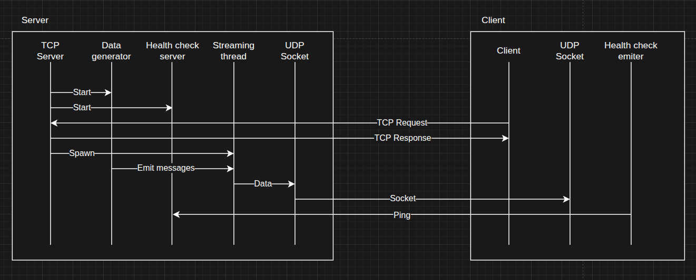

<div style="display: flex; flex-direction: column; justify-content: center; align-items: center;" align="center">
    <h1><code>stocks</code></h1>
    <h4>Built with <a href="https://rust-lang.org/">🦀</a></h4>
</div>


[](https://github.com/arthurhovhannisyan31/stocks/actions/workflows/code-validation.yml)
[](https://github.com/arthurhovhannisyan31/stocks/actions/workflows/packages-validation.yml)

## Overview

This is a simple data streaming client-server application.

[Server](./modules/quote-server/README.md) generates random stock quotes data and streams filtered data to client and
the
[Client](./modules/quote-client/README.md) sends `TCP Request` and accepts streamed data on `UDP Socket`.
Server health check mechanism excludes inactive clients from data streming and client sends ping messages to server.
The [Common](./modules/common/README.md) crate contains all the reused modules in workspace.

## Description



## Usage

Please find the latest build binaries in
the [GH Releases](https://github.com/arthurhovhannisyan31/stocks/releases).
Download the archived binaries for your OS and use the `quote-server` and `quote-client` files from the `target/release`
folder.

```shell
quote-server -f server-tickers.txt
```

```shell
quote-client -f client-tickers.txt -s 127.0.0.1:8000 -S 8001 -c 127.0.0.1:8002 
```

## Stack

- [Rust](https://rust-lang.org/)
- [Clap](https://crates.io/crates/clap)
- [Serde](https://crates.io/crates/serde)
- [Signal hook](https://crates.io/crates/signal_hook)
- [Tracing](https://crates.io/crates/tracing)

## Credits

Crate implemented as part of the [Yandex practicum](https://practicum.yandex.ru/) course.

## License

Licensed under either of at your option.

* Apache License, Version 2.0, [LICENSE-APACHE](./LICENSE_APACHE) or http://www.apache.org/licenses/LICENSE-2.0
* MIT license [LICENSE-MIT](./LICENSE_MIT) or http://opensource.org/licenses/MIT
