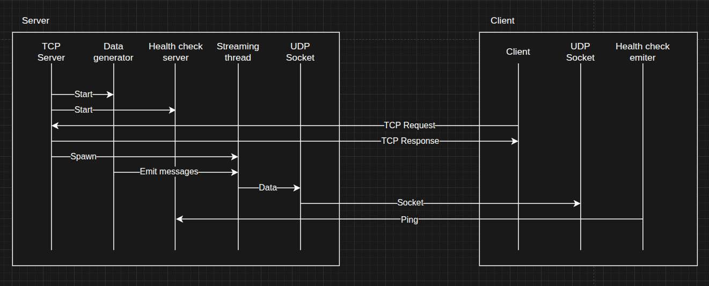

<div style="display: flex; flex-direction: column; justify-content: center; align-items: center;" align="center">
    <h1><code>stocks</code></h1>
    <h4>Built with <a href="https://rust-lang.org/">🦀</a></h4>
</div>

[](https://github.com/arthurhovhannisyan31/stocks/actions/workflows/code-validation.yml)
[](https://github.com/arthurhovhannisyan31/stocks/actions/workflows/packages-validation.yml)

## Overview

`stocks` is a small client-server application that streams stock quotes, written in Rust using only `std` networking
and threads.

The [quote server](./modules/quote-server/README.md) generates random stock quotes. It streams each client only the
tickers that client asked for. The [quote client](./modules/quote-client/README.md) subscribes over `TCP`, receives
quotes over `UDP` and keeps its subscription alive with periodic health-check pings. Shared types, errors and helpers
live in the [common](./modules/common/README.md) crate.

| Crate                                       | Kind   | Description                                         |
|---------------------------------------------|--------|-----------------------------------------------------|
| [`quote-server`](./modules/quote-server)    | binary | Generates quotes and streams filtered data to clients |
| [`quote-client`](./modules/quote-client)    | binary | Requests a ticker subscription and prints received quotes |
| [`common`](./modules/common)                | lib    | `StockQuote`/`StockRequest`/`StockResponse`, `AppError`, CLI validators, signal hooks |

## Architecture



1. The client binds a local `UDP` socket and sends a `STREAM` request over `TCP` to the server. The request lists the
   client's tickers and its UDP address.
2. The server answers on the same `TCP` stream with an `Ok` or `Error` response. On `Ok` it registers the client and
   gives it a dedicated streaming thread.
3. Every second the server generates a fresh batch of quotes and broadcasts it to every client thread. Each thread
   filters the batch by the client's tickers and sends it to the client over `UDP`.
4. The client pings the server's `UDP` port every 50 ms. A client that sends no ping for 5 s is considered inactive and
   is removed from streaming.
5. Both binaries listen for termination signals ([TERM_SIGNALS](https://docs.rs/signal-hook/latest/signal_hook/consts/signal/index.html))
   and shut down gracefully.

## Protocol

All messages are `JSON` encoded as `utf-8` bytes.

**Request** (client → server, TCP):

```json
{ "kind": "STREAM", "addr": "127.0.0.1:8002", "tickers": ["AAPL", "GOOGL", "TSLA"] }
```

**Response** (server → client, TCP). `status` is `"Ok"` or `"Error"`:

```json
{ "status": "Ok", "message": "ok" }
```

**Quotes** (server → client, UDP), one array per tick:

```json
[
  { "ticker": "AAPL", "price": 1.12, "volume": 3150, "timestamp": 1767225600000 },
  { "ticker": "GOOGL", "price": 1.12, "volume": 4821, "timestamp": 1767225600000 }
]
```

**Health check** (client → server, UDP): the client's UDP address as plain text.

## Getting started

### Prebuilt binaries

Download the archive for your OS from [GitHub Releases](https://github.com/arthurhovhannisyan31/stocks/releases). The
`quote-server` and `quote-client` binaries are in its `target/release` folder.

### Build from source

Requires Rust **1.87.0** or newer (edition 2024).

```shell
git clone https://github.com/arthurhovhannisyan31/stocks.git
cd stocks
cargo build --release
```

The binaries are written to `target/release/`.

### Run locally

Sample ticker files are provided in [`mocks/`](./mocks). Start the server:

```shell
cargo run -p quote-server -- -f mocks/server-tickers.txt
```

Then start a client in another terminal:

```shell
cargo run -p quote-client -- -f mocks/client-tickers.txt -s 127.0.0.1:8000 -S 8001 -c 127.0.0.1:8002
```

You can run several clients at once. Give each one its own `-c` address, e.g. `127.0.0.1:8003`. Press `Ctrl+C` to stop
either side.

### Tickers file

A plain `.txt` file with one ticker per line:

```text
AAPL
GOOGL
TSLA
```

The server only generates quotes for the tickers in its own file. A client receives only the tickers it requests that
the server also knows.

## CLI reference

### `quote-server`

| Flag                  | Type   | Description             |
|-----------------------|--------|-------------------------|
| `-f, --tickers-file`  | path   | Tickers file (`.txt`)   |
| `-h, --help`          |        | Print help              |
| `-V, --version`       |        | Print version           |

### `quote-client`

| Flag                     | Type          | Description                                       |
|--------------------------|---------------|---------------------------------------------------|
| `-f, --tickers-file`     | path          | Tickers file (`.txt`)                             |
| `-s, --server-tcp-addr`  | `ip:port`     | Server TCP address, e.g. `127.0.0.1:8000`         |
| `-S, --server-udp-port`  | `u16`         | Server UDP port; the IP is taken from `-s`        |
| `-c, --client-udp-addr`  | `ip:port`     | Local UDP address the client binds to             |
| `-h, --help`             |               | Print help                                        |
| `-V, --version`          |               | Print version                                     |

## Configuration defaults

These values are compile-time constants in
[`quote-server/src/configs.rs`](./modules/quote-server/src/configs.rs) and
[`quote-client/src/configs.rs`](./modules/quote-client/src/configs.rs).

| Setting                          | Value            |
|----------------------------------|------------------|
| Server TCP address               | `127.0.0.1:8000` |
| Server UDP address               | `127.0.0.1:8001` |
| Quote generation interval        | 1 s              |
| Client inactivity timeout        | 5 s              |
| Client health-check ping interval | 50 ms           |

## Project structure

```text
.
├── modules/
│   ├── common/          # shared types, errors and utils
│   ├── quote-client/    # client binary
│   └── quote-server/    # server binary
├── mocks/               # sample tickers files
├── configs/             # git hooks and helper scripts
├── static/images/       # documentation assets
└── .github/             # CI, release and dependabot workflows
```

## Development

Install the project git hooks (format and lint checks on commit and push):

```shell
make prepare
```

Common commands:

```shell
cargo fmt --all
cargo clippy --all-features --all-targets
cargo test
```

On every push, CI runs `cargo check`, `rustfmt`, `clippy` and the test suite. To publish a release, run the **Easy
release** workflow. It merges `develop` into `main`, tags a semantic version and uploads the build artifacts to GitHub
Releases.

## Stack

- [Rust](https://rust-lang.org/)
- [Clap](https://crates.io/crates/clap)
- [Serde](https://crates.io/crates/serde) / [serde_json](https://crates.io/crates/serde_json)
- [Signal hook](https://crates.io/crates/signal-hook)
- [Tracing](https://crates.io/crates/tracing)
- [parking_lot](https://crates.io/crates/parking_lot)
- [rand](https://crates.io/crates/rand)
- [thiserror](https://crates.io/crates/thiserror) / [anyhow](https://crates.io/crates/anyhow)

## Credits

Implemented as part of the [Yandex Practicum](https://practicum.yandex.ru/) course.

## License

Licensed under either of the following, at your option:

- Apache License, Version 2.0 ([LICENSE_APACHE](./LICENSE_APACHE) or http://www.apache.org/licenses/LICENSE-2.0)
- MIT license ([LICENSE_MIT](./LICENSE_MIT) or http://opensource.org/licenses/MIT)
